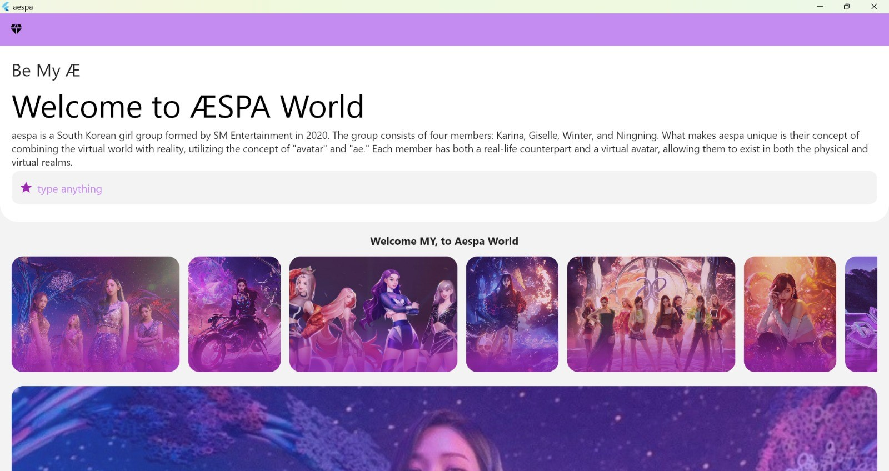
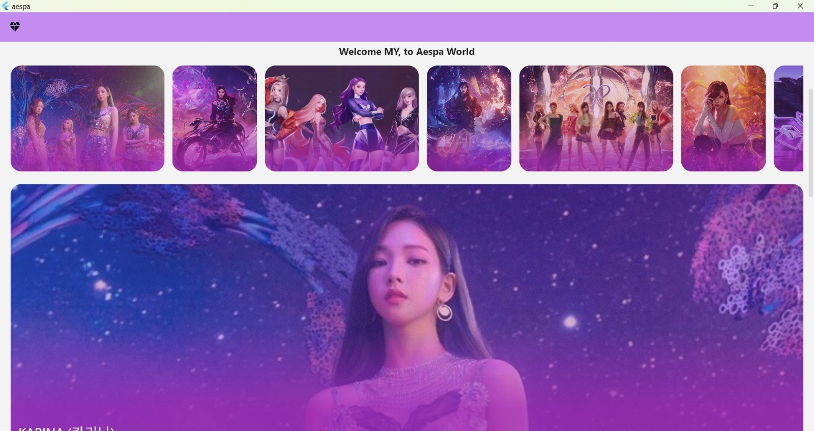
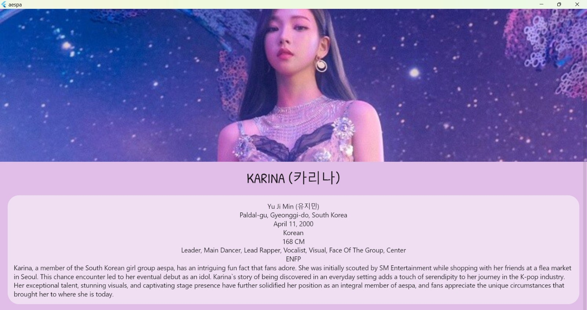

# 🌟 Flutter AESPA Member 🌟

Selamat datang di repositori **Flutter AESPA Member**! 🎉 Proyek ini adalah aplikasi Flutter yang menampilkan informasi tentang anggota grup musik AESPA. 📱🎶

## 🚀 Fitur Utama

- **Profil Anggota**: Tampilkan informasi profil lengkap dari setiap anggota AESPA. 👩‍🎤👩‍🎤👩‍🎤👩‍🎤
- **Galeri Foto**: Lihat galeri foto resmi dari anggota AESPA. 📸
- **Biografi**: Baca biografi dan informasi menarik tentang setiap anggota. 📚

## 📸 Tampilan
### First screen




### Second screen


## 🛠️ Teknologi yang Digunakan

- **Framework**: Flutter 🛠️

## 📋 Cara Instalasi

1. **Clone Repository**:
    ```bash
    git clone https://github.com/username/flutter-aespa-member.git
    cd flutter-aespa-member
    ```

2. **Instalasi Dependencies**:
    ```bash
    flutter pub get
    ```

3. **Konfigurasi Environment**:
    - Jika Anda menggunakan API atau database, pastikan untuk mengonfigurasi file `.env` atau menggunakan pengaturan yang sesuai untuk aplikasi Anda.

4. **Jalankan Aplikasi**:
    - **Untuk menjalankan di emulator atau perangkat fisik**:
      ```bash
      flutter run
      ```

5. **Buka di Browser**:
    - Aplikasi akan dimulai pada emulator atau perangkat fisik yang terhubung. 🌐

---

Terima kasih telah menggunakan **Flutter AESPA Member**! 🚀💖
